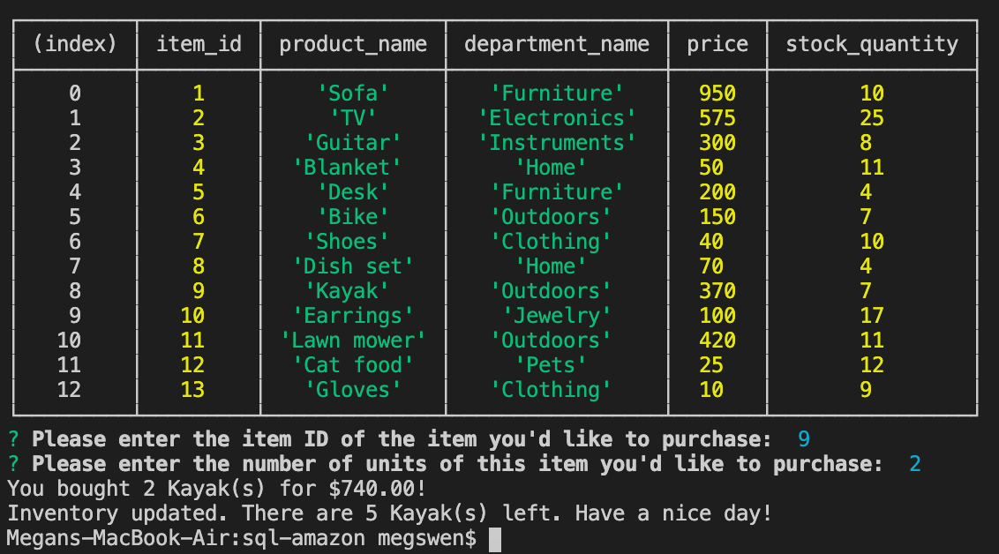
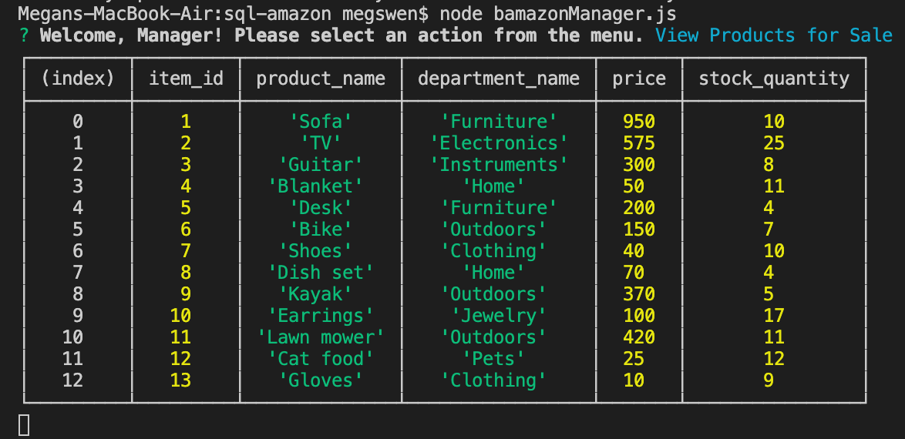

# sql-amazon

# Description
In this Amazon-esque game, you can purchase items as the customer, or manage inventory as the manager. 

# Technology used
* MySQL
* javascript
* node.js
* Inquirer

# Customer abilities
As a customer, you get to select an item to purchase from a table of products and select the amount of that item you'd like to buy.

How to play as a customer
-------------------------
1. Open the program in Terminal/Bash and install all required packages using the following command:

    `$ npm install`

2. To start the game, type in the following command:

    `$ node bamazonCustomer.js`

3. You will be asked for the item ID of the item you'd like to purcahse, and then the quantity you'd like to purchase. Enter both.

4. You will be notified of the item you purchased, how many, and your grand total.

# Manager abilities
As a manager, you get to view a table of products for sale, view a table of all low-inventory products, restock products, and add new products to your inventory.

How to play as a manager
------------------------
1. Open the program in Terminal/Bash and install all required packages using the following command:

    `$ npm install`

2. To start the game, type in the following command:

    `$ node bamazonManager.js` 

3. Select "View Products for Sale", "View Low Inventory", "Add to Inventory", or "Add New Product".

    1. View Products for Sale will display a table showing all products for sale.

        

    2. View Low Inventory will display a table showing all products that have less than 5 items in stock

        

    3. Add to Inventory will ask you to enter the item ID of the product you'd like to add and how many of that item should be added, and then show you that the table was updated.

        

    4. Add New Product will ask you for the product name, department name, price, and number of items, and then show you that the product was added.

        

# Author
[Megan Swenson](https://github.com/megswen)